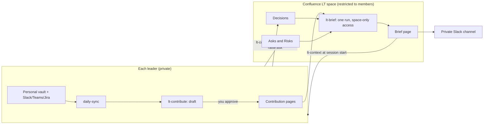

# A leadership second brain on Confluence

A shared layer for a small leadership team (this guide assumes four people
who all read and write) that sits **on top of** each person's own setup:
personal vaults, Slack, Teams, Jira, and Confluence stay as they are.
Once a day, what the whole team needs in order to decide well flows into a
shared Confluence space, and a morning brief flows back out.

## The design in one paragraph

**Federate the contributions, centralize the synthesis.** Each leader's own
Claude reads that leader's own sources, with that leader's permissions, and
publishes a short distillation, after the leader approves it. A separate
run reads *only* the shared space and writes one brief. Nobody's raw
messages, notes, or inbox are ever visible to anyone else, and no single
job needs access to everyone's data.



## What's in the box

| Piece | What it is |
|---|---|
| `lt-setup` | One-time: builds the page skeleton in a space you created and restricted; writes each person's `LT Config.md`. |
| `lt-contribute` | Daily: drafts your contribution from your allowlisted notes, screens it, publishes only on your approval. Draft-only when unattended. |
| `lt-brief` | Daily (and weekly): reads only the LT space, writes the brief, posts a pointer to a verified private Slack channel. |
| `lt-context` | Session start: loads LT Focus, latest brief, asks addressed to you, recent decisions. During a session: logs decisions, asks, risks as pages. |
| `templates/leadership/` | Page templates (charter, focus, decision, ask/risk, contribution, brief) and the config note. |

All of these are Claude Code skills in `.claude/skills/`. They are
instructions that drive an Atlassian MCP server (and optionally a Slack
one) you have connected and authorized. They don't talk to Confluence
themselves.

## The space

One restricted Confluence space; **you create it and set its permissions**
(the skills can't, deliberately). It must be limited to exactly the LT
members, with no org-wide or anonymous access.

```
LT Second Brain (charter)
├── LT Focus            edited only by its owner (the Sr Director)
├── Decisions           one page per decision
├── Asks and Risks
│   ├── Open
│   └── Closed          resolved items are moved here, never deleted
├── Contributions       one page per member per day
└── Briefs              daily and weekly
```

Design rules that make four people editing one space work:
- **One author per page.** Contributions are titled
  `Contribution 2026-10-02 · Name`, briefs `Brief 2026-10-03`. Two people
  never write to the same page, so there are no edit conflicts.
- **Append-only history.** Decisions get a Revisions section; closed asks
  move to Closed. Nothing is deleted.
- **Disagreement is recorded**, in the decision page, not smoothed over.
- **Agents draft, humans approve.** Unattended runs can only draft or
  read. The one automatic write is the brief, which lives in the shared
  space and cites its sources.

## What flows in, and what never does

A contribution item must pass one test: *would this change someone else on
the LT's decision this week?* Status updates and anything the team can
already see in Jira or Slack fail it.

`lt-contribute` reads only the folders in your `contribute-allow` list and
never anything in `contribute-deny` (the denylist wins). It then screens
for anything about an individual's performance, pay, health, conduct, or
career; unannounced restructuring or hiring; third-party confidences; and
personal content. Those items are dropped and reported only as a count.

**Before you start, agree as a team** what never leaves a personal vault,
and check your company's policy on AI processing of this kind of content.
The screen is a safety net, not a substitute for that agreement. Put every
folder that holds notes about individuals (1:1s, development plans, hiring)
in your denylist before the first draft.

## Setup

1. **Create the space and restrict it** to the four members in Confluence.
2. Connect and authorize an Atlassian MCP server (and Slack, if you want
   the pointer message) in your Claude client.
3. One person runs `lt-setup` in *create* mode; the others run it in
   *join* mode. Each of you ends up with a personal `LT Config.md`. Review
   your allowlist and denylist line by line.
4. Create a **private Slack channel containing exactly the four of you**
   and put its name in your config. `lt-brief` posts there only if it
   verifies the membership matches; otherwise it saves a draft.
5. Add one line to your vault's `CLAUDE.md` (`lt-setup` offers this) so
   each session starts with the shared layer.

## Rollout

Don't automate on day one.

- **Week 1, by hand.** Everyone runs `lt-contribute` in *dry-run* mode
  once a day and posts the text manually. See what the screen drops, and
  adjust the allowlist. Run `lt-brief` in dry-run mode yourself.
- **Week 2, contributions.** Turn on `daily-sync` on a schedule for each
  person (it saves an `## LT draft`); each approves and publishes the
  next morning.
- **Week 3, the brief.** Schedule `lt-brief`. Keep `slack-post: draft`
  until you've seen a week of briefs, then consider `send`.

## Scheduling

Skills run only when something starts them. Any scheduler works. With cron
and Claude Code in non-interactive mode, from the vault folder:

```cron
# each member: end of day, saves an LT draft, never publishes
45 17 * * 1-5  cd ~/ObsidianVaults/SecondBrain && claude -p "Run the daily-sync skill." --allowedTools "Read" "Edit" "Write"

# one designated runner: 07:00 daily brief, Friday weekly mode
0 7 * * 1-4    cd ~/lt-runner && claude -p "Run the lt-brief skill in daily mode." --allowedTools "Read" "Edit" "Write"
0 7 * * 5      cd ~/lt-runner && claude -p "Run the lt-brief skill in weekly mode." --allowedTools "Read" "Edit" "Write"
```

Unattended runs can't answer permission prompts, so pre-approve only what
each run needs, including the Atlassian (and Slack) MCP tools it uses, and
check that the MCP authorization persists between runs. Test each by
hand once before scheduling. The brief runner is a small vault that holds
only an `LT Config.md`, which keeps it from reading anyone's notes.

## Ownership

| Role | Who | Does |
|---|---|---|
| Focus owner | the Sr Director | Only editor of LT Focus; reviews it weekly. |
| Brief runner | one designated member | Owns the schedule, fixes it when it breaks. |
| Everyone | all four | Contributes daily, reads the brief, closes their own asks. |

## Things that go wrong

- **Status-report theater.** If contributions become progress updates,
  people stop reading. Hold to the "changes a decision this week" test, and
  move routine items to the weekly.
- **A silent gap.** If someone stops contributing, the brief says "No
  contribution from X" instead of hiding it. Treat that as a signal, not an
  accusation.
- **Stale asks.** Overdue asks are listed first. Close or renegotiate them;
  don't let them sit.
- **Over-trusting the screen.** It will occasionally miss. That's why a
  human approves every contribution, and why the denylist matters more
  than the screen.
- **Page injection.** The brief treats page content as data, but only
  members can write to the space, which is why the space restriction is the
  most important control.

## Honest limits

- These skills have been written and reviewed but not yet run against a
  live Confluence space. Do the week-1 dry runs before trusting them.
- Confluence MCP tool names vary by server; the skills discover them with
  `ToolSearch` instead of hardcoding names.
- Searching "asks addressed to me" relies on page titles and the "To"
  field, so keep to the title conventions above.
